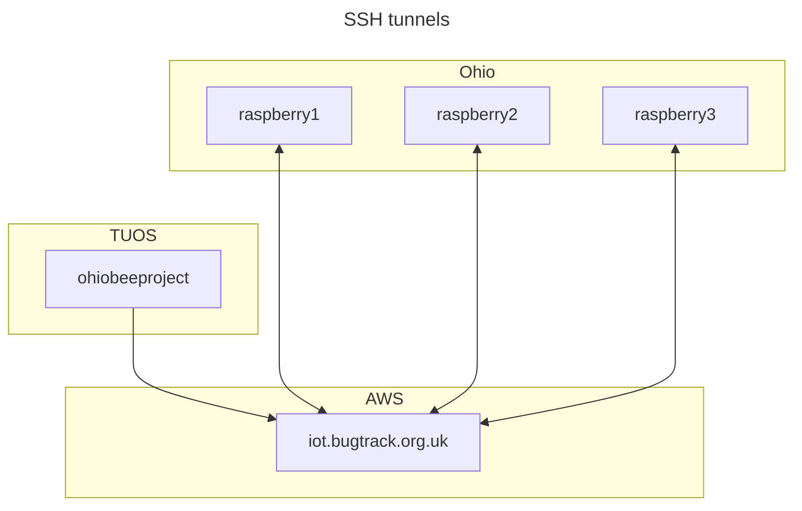

# Ohio bee tracker data pipeline

This repository contains scripts to implement the automatic transfer of data from the Raspberry Pi machines deployed in Ohio to the University of Sheffield infrastructure. It runs a task on a regular schedule that copies data from the machines and deletes old files using a secure shell (SSH) connection.

See [issue #20](https://github.com/SheffieldMLtracking/BBSRC_ohio/issues/20).

The repository contains the following directories:

- `scripts/systemd`  contains the [systemd units](https://systemd.io/) that define this system.

# Installation

Please follow the following steps to set up the machine.

## systemd service

First, install dependencies

```bash
sudo apt install rsync
```

Create the necessary service user accounts.

Set up the SSH keys (see the SSH configuration section below).

Clone this repository.

Install systemd units.

```bash
sudo cp --verbose ./scripts/systemd/*.service /etc/systemd/system/
sudo cp --verbose ./scripts/systemd/*.timer /etc/systemd/system/
```

Install the shell script:

```bash
sudo mkdir /opt/data-pipeline
sudo cp ./scripts/copy-to-storage.sh /opt/data-pipeline/copy-to-storage.sh
```

Activate the service.

```bash
sudo systemctl enable copy-to-storage
```

## SSH configuration

This SSH configuration is used by the `rsync` command in this service to establish a connection to the Raspberry Pis and transfer data into the TUOS campus network. This system connects to the target machines using the cloud machine as a ["jump" host](https://en.wikibooks.org/wiki/OpenSSH/Cookbook/Proxies_and_Jump_Hosts#Jump_Hosts_--_Passing_Through_a_Gateway_or_Two) that uses a third machine as an intermediate.

The diagram below shows the different machines involved and how the SSH connections are set up. Each arrow represents an SSH connection, where the double-headed arrows indicate a reverse tunnel, where a local port on one machine is bound to a persistent SSH connection on the other machine. This means we can connect directly from the University of Sheffield (TUOS) campus network onto the Ohio campus network using the AWS virtual machine as an intermediate jump host.



To make the remote hosts accept key-based authentication, we need to configure the [`authorized_keys` file](https://www.ssh.com/academy/ssh/authorized-keys-file) each target machine (the jump host *and* the Raspberry Pis). The configuration below should be set up on the TUOS virtual machine. The public keys must be installed on the remote hosts located at AWS and Ohio to enable automatic key-based authentication.

## Jump host

For the data transfer service machine (`ohiobeeproject`) to connect to the jump host, we need an SSH key. Create a key for the jump host and copy the public key to the target machine.

```bash
user="data-pipeline-svc"
ssh-keygen -f ~/.ssh/bugtrack -N "" -t ecdsa
scp ~/.ssh/bugtrack.pub $user@iot.bugtrack.org.uk:~/.ssh/authorized_keys
```

## Raspberry Pis

Specify the identifiers of the target machines, either a numerical range or specific numbers.

```bash
raspberry_ids="$(seq 1 50)"
raspberry_ids="31 34 35"
```

Generate SSH private and public keys for each target machine.

```bash
for i in $raspberry_ids
do
  host="raspberry$i"
  ssh-keygen -f ~/.ssh/$host -N "" -t ecdsa
done
```

Configure the jump connection using the [SSH configuration file](https://www.ssh.com/academy/ssh/config)

```bash
nano ~/.ssh/config
```

A Bash script to generate most of the config file:

```bash
for i in $raspberry_ids
do
  host="raspberry$i"
  port=$((5000 + $i))
  printf "host raspberry$i\n  hostname localhost\n  user pi\n  port $port\n  identityfile ~/.ssh/$host\n  proxyjump awsbox\n\n"
done
```

This file should look something like this, with an [entry](https://www.ssh.com/academy/ssh/config) for each target remote host:

```
# AWS EC2 instance
host awsbox
  hostname iot.bugtrack.org.uk
  port 22
  identityfile ~/.ssh/bugtrack
  user data-pipeline-svc

# Raspberry Pi
host raspberry1
  hostname localhost
  port 5001
  user pi
  identityfile ~/.ssh/raspberry1
  proxyjump awsbox
```

Install the public keys onto each Raspberry Pi (this step will require username-password authentication) to enable passwordless key-based authentication.

```bash
for i in $raspberry_ids
do
  host="raspberry$i"
  scp ~/.ssh/$host.pub $host:~/.ssh/authorized_keys
done
```

We can now set up the [`known_hosts` file](https://www.ssh.com/academy/ssh/host-key#known-host-keys) which stores recognised remote machines.

```bash
ssh-keyscan -H iot.bugtrack.org.uk >> ~/.ssh/known_hosts
```

Next, check the key fingerprint for each Ohio host.
You need to enter `yes` for each prompt to confirm that the host key fingerprint is correct.
This only needs to be done once when the connection is first configured.

```bash
for i in $raspberry_ids
do
  host="raspberry$i"
  echo $host
  ssh $host -t "whoami"
done
```

To test this out manually, try a passwordless connection to a single remote host:

```bash
ssh raspberry31
```

# Usage

The services defined in this repository are `systemd` units that are controlled using [`systemctl`](https://www.freedesktop.org/software/systemd/man/latest/systemctl.html).

View the service status

```bash
sudo systemctl status copy-to-storage.timer
```

Start the timer

```bash
sudo systemctl start copy-to-storage.timer
```

Stop the timer

```bash
sudo systemctl stop copy-to-storage.timer
```

To view the `systemd` logs using [journalctl](https://manpages.ubuntu.com/manpages/xenial/en/man1/journalctl.1.html):

```bash
journalctl -u copy-to-storage.service --lines=100
```

