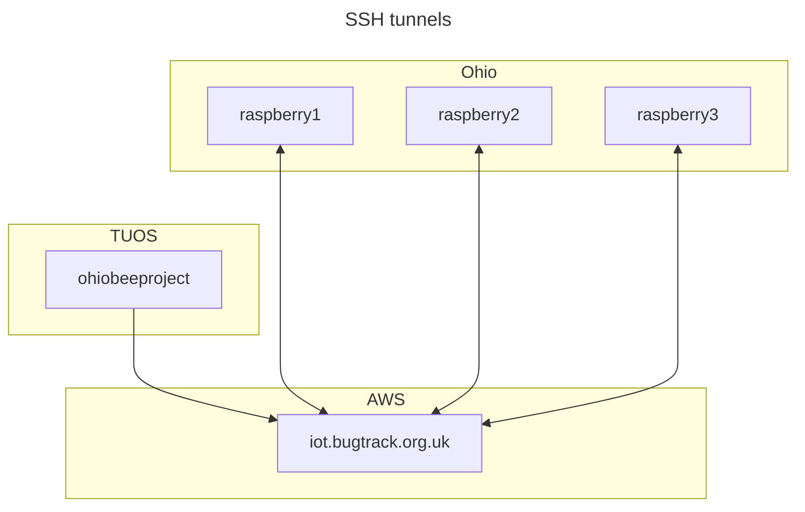

# Ohio bee tracker data pipeline

This repository contains scripts to implement the automatic transfer of data from the Raspberry Pi machines deployed in Ohio to the University of Sheffield infrastructure.

See [issue #20](https://github.com/SheffieldMLtracking/BBSRC_ohio/issues/20).

The repository contains the following directories:

- `scripts/systemd`  contains the [systemd units](https://systemd.io/) that define this system.

# Installation

Please follow the following steps to set up the machine.

First, install dependencies

```bash
sudo apt install rsync
```

Set up the SSH keys (see the SSH configuration section below).

Clone this repository.

Install systemd units.

```bash
sudo cp --verbose ./scripts/systemd/* /etc/systemd/
```

Activate the service.

```bash
sudo systemctl enable copy-to-storage
```

## SSH configuration

This system connects to the target machines using the cloud machine as an intermediate "jump" host.



Generate SSH private and public keys for each target machine.

```bash
for i in $(seq 1 10)
do
  host="raspberry$i"
  ssh-keygen -f ~/.ssh/$host -N="" -t ecdsa
done
```

Configure the jump connection using the [SSH configuration file](https://www.ssh.com/academy/ssh/config)

```bash
nano ~/.ssh/config
```

A Bash script to generate most of the config file:

```bash
for i in $(seq 1 10)
do
  host="raspberry$i"
  port=$((5000 + $i))
  printf "host raspberry$i\n  hostname localhost\n  port $port\n  identityfile ~/.ssh/$host\n  proxyjump awsbox\n\n"
done
```

This file should look something like this:

```
# AWS EC2 instance
host awsbox
  hostname iot.bugtrack.org.uk
  port 22
  identityfile ~/.ssh/id_rsa
  user johndoe

# Raspberry Pi
host raspberry1
  hostname localhost
  port 5001
  identityfile ~/.ssh/raspberry1
  proxyjump awsbox
```

This allows us to access the remote host using this SSH command:

```bash
ssh raspberry1
```

# Usage

The services defined in this repository are `systemd` units that are controlled using [`systemctl`](https://www.freedesktop.org/software/systemd/man/latest/systemctl.html).

Start the service.

```bash
sudo systemctl start copy-to-storage
```

Stop the service.

```bash
sudo systemctl stop copy-to-storage
```
