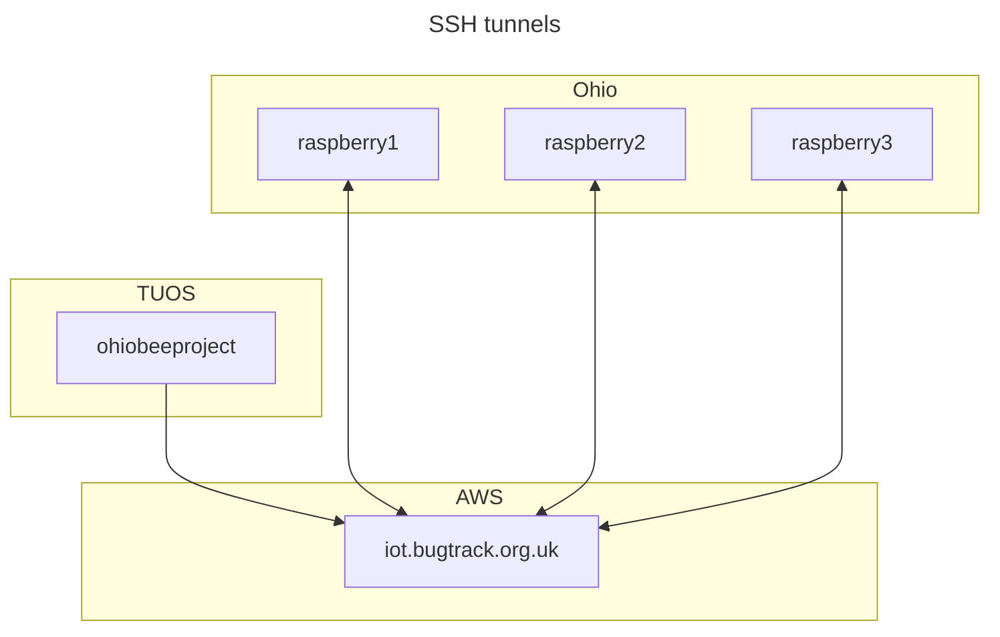

# Ohio bee tracker data pipeline

This repository contains scripts to implement the automatic transfer of data from the Raspberry Pi machines deployed in Ohio to the University of Sheffield infrastructure.

See [issue #20](https://github.com/SheffieldMLtracking/BBSRC_ohio/issues/20).

The repository contains the following directories:

- `scripts/systemd`  contains the [systemd units](https://systemd.io/) that define this system.

# Installation

Please follow the following steps to set up the machine.

## systemd service

First, install dependencies

```bash
sudo apt install rsync
```

Set up the SSH keys (see the SSH configuration section below).

Clone this repository.

Install systemd units.

```bash
sudo cp --verbose ./scripts/systemd/* /etc/systemd/
```

Install the shell script:

```bash
sudo mkdir /opt/data-pipeline
sudo cp ./scripts/copy-to-storage.sh /opt/data-pipeline/copy-to-storage.sh
```

Activate the service.

```bash
sudo systemctl enable copy-to-storage
```

## SSH configuration

This system connects to the target machines using the cloud machine as a ["jump" host](https://en.wikibooks.org/wiki/OpenSSH/Cookbook/Proxies_and_Jump_Hosts#Jump_Hosts_--_Passing_Through_a_Gateway_or_Two) that uses a third machine as an intermediate.

The diagram below shows the different machines involved and how the SSH connections are set up. Each arrow represents an SSH connection, where the double-headed arrows indicate a reverse tunnel, where a local port on one machine is bound to a persistent SSH connection on the other machine. This means we can connect directly from the University of Sheffield (TUOS) campus network onto the Ohio campus network using the AWS virtual machine as an intermediate jump host.



Generate SSH private and public keys for each target machine.

```bash
for i in $(seq 1 3)
do
  host="raspberry$i"
  ssh-keygen -f ~/.ssh/$host -N="" -t ecdsa
done
```

To make the remote hosts accept key-based authentication, we need to configure the [`authorized_keys` file](https://www.ssh.com/academy/ssh/authorized-keys-file) each target machine (the jump host *and* the Raspberry Pis). On your local machine, copy the public key to the target machine:

```bash
user="my_username"
scp ~/.ssh/my_ssh_key.pub $user@iot.bugtrack.org.uk:~/.ssh/authorized_keys
```

The same must be done for each Raspberry Pi (this step will require username-password authentication)

```bash
for i in $(seq 1 3)
do
  host="raspberry$i"
  scp ~/.ssh/$host.pub $host:~/.ssh/authorized_keys
done
```

Configure the jump connection using the [SSH configuration file](https://www.ssh.com/academy/ssh/config)

```bash
nano ~/.ssh/config
```

A Bash script to generate most of the config file:

```bash
for i in $(seq 1 3)
do
  host="raspberry$i"
  port=$((5000 + $i))
  printf "host raspberry$i\n  hostname localhost\n  user pi\n  port $port\n  identityfile ~/.ssh/$host\n  proxyjump awsbox\n\n"
done
```

This file should look something like this, with an [entry](https://www.ssh.com/academy/ssh/config) for each target remote host:

```
# AWS EC2 instance
host awsbox
  hostname iot.bugtrack.org.uk
  port 22
  identityfile ~/.ssh/id_rsa
  user johndoe

# Raspberry Pi
host raspberry1
  hostname localhost
  port 5001
  user pi
  identityfile ~/.ssh/raspberry1
  proxyjump awsbox
```

This allows us to access the remote host using this SSH command:

```bash
ssh raspberry1
```

This SSH configuration is used by the `rsync` command in this service to establish a connection to the Raspberry Pis and transfer data into the TUOS campus network.

# Usage

The services defined in this repository are `systemd` units that are controlled using [`systemctl`](https://www.freedesktop.org/software/systemd/man/latest/systemctl.html).

Start the service.

```bash
sudo systemctl start copy-to-storage
```

Stop the service.

```bash
sudo systemctl stop copy-to-storage
```

To view the `systemd` logs using [journalctl](https://manpages.ubuntu.com/manpages/xenial/en/man1/journalctl.1.html):

```bash
journalctl -u copy-to-storage.service --lines=100
```

