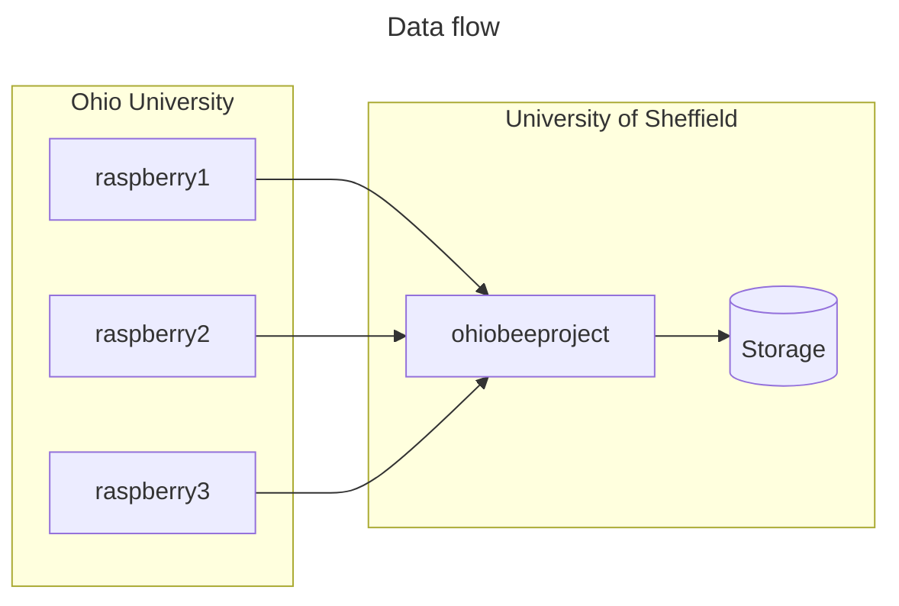
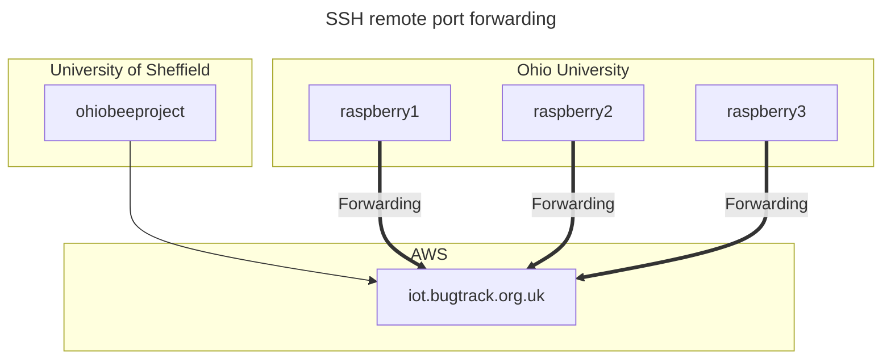
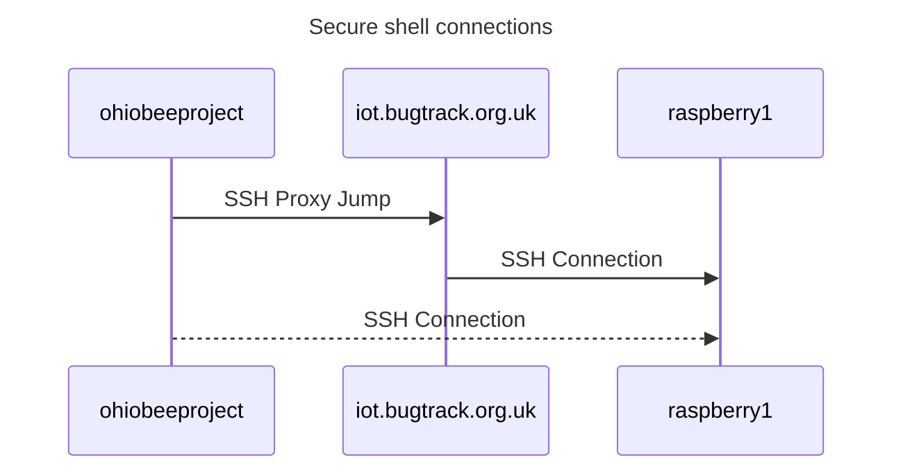

# Ohio bee tracker data pipeline

This repository defines a service that performs automatic transfer of data from the Raspberry Pi (RPI) machines deployed at the University of Ohio to the research infrastructure at the University of Sheffield. It runs a task on a regular schedule that copies data from the remote machines and deletes old files via a secure shell (SSH) connection.

See also: [issue #20](https://github.com/SheffieldMLtracking/BBSRC_ohio/issues/20).

An overview diagram of the flow of research data between the various machines (boxes) is shown below. The shaded areas represent different physical locations and networks. The arrows represent the direction in which data are moved.



# Overview

This service runs regularly and iterates through the RPIs one at a time, copy the research data, and prevent the storage on the remote devices from filling up. For each remote machine, the process works as follows:

1. Connect to a remote machine via secure shell;
2. Sync all the data files to a specified directory;
3. Upon successful transfer, delete each data file from the remote machine.

## Remote sync

The data transfer is implemented using the remote synchronizing (`rsync`) tool which compresses files during transit and removes the files from the remote machine using [the `--delete` option](https://manpages.ubuntu.com/manpages/focal/man1/rsync.1.html). If a file is modified during transfer, `rsync` will fail and that file will be transferred during the subsequent run.

It will only delete files *only* after a successful sync, to avoid accidentally deleting data that hasn't been transferred first. This is designed to prevent accidental data loss and preserve the limited storage space on the remote machines.

## Repository contents

The repository contains the following directories and files:

- `./systemd`  contains the [systemd units](https://systemd.io/) that define the service using the Ubuntu service management system.
  - The timer (`copy-to-storage.timer`) will run on a regular schedule and initiate the service (`copy-to-storage.service`) which runs a shell script that performs the data operations.

- `./scripts/copy-to-storage.sh` is a Bash shell script that iterates over the target machines and runs the data transfer and file deletion operations.

There are also some useful Unix shell scripts for inspecting the remote machines.

# Installation

Please follow the following steps to set up the machine. Also, see [`install.sh`](./install.sh). These steps assume that a recent Linux (Ubuntu) operating system is used.

## Install the systemd service

First, install dependencies

```bash
sudo apt install rsync
```

Create the necessary service user accounts with write permissions to the research storage area. The service uses its own system user account that is defined in `scripts/copy-to-storage.service` in the `[Service]` [User=](https://www.freedesktop.org/software/systemd/man/latest/systemd.exec.html#User=) option.

Set up the SSH keys (see the SSH configuration section below).

[Clone](https://git-scm.com/docs/git-clone) this repository.

Install [systemd units](https://www.digitalocean.com/community/tutorials/understanding-systemd-units-and-unit-files).

```bash
sudo cp --recursive --verbose ./systemd/* /etc/systemd/system/
```

Reload the systemd units using [`systemctl`](https://manpages.ubuntu.com/manpages/xenial/en/man1/systemctl.1.html)

```bash
sudo systemctl daemon-reload
```

Install the shell script:

```bash
sudo mkdir /opt/data-pipeline
sudo cp ./scripts/copy-to-storage.sh /opt/data-pipeline/copy-to-storage.sh
```

Enable the service. (This will *not* activate the service.)

```bash
sudo systemctl enable copy-to-storage
```

To activate the service, please read the [usage instructions](#usage) below.

## SSH configuration

The service uses a specific SSH configuration to enable the `rsync` command to establish a connection to the Raspberry Pis (RPIs) and transfer data into the University of Sheffield (UoS) campus network. This system connects to the target machines using the cloud machine as a ["jump" host](https://en.wikibooks.org/wiki/OpenSSH/Cookbook/Proxies_and_Jump_Hosts#Jump_Hosts_--_Passing_Through_a_Gateway_or_Two), where this third machine is an intermediate.

### Reverse tunnels

The diagram below shows the different machines involved and how the SSH connections are set up. For more information, see [issue #16](https://github.com/SheffieldMLtracking/BBSRC_ohio/issues/16). Each arrow represents an SSH connection, where the thick arrows indicate [remote port forwarding](https://help.ubuntu.com/community/SSH/OpenSSH/PortForwarding#Remote_Port_Forwarding) to establish a reverse tunnel, where a local port on one machine is bound to a persistent SSH connection on the other machine.



This means we can connect directly from the University of Sheffield (UoS) campus network onto the Ohio campus network using the Amazon Web Services (AWS) virtual machine as an intermediate jump host.



Each machine must be able to connect to its desired target automatically, without human intervention. To make the remote hosts accept key-based authentication, we need to configure the [`authorized_keys` file](https://www.ssh.com/academy/ssh/authorized-keys-file) each target machine (the jump host *and* the Raspberry Pis). The configuration below should be set up on the UoS virtual machine. The public keys must be installed on the remote hosts located at AWS and Ohio to enable automatic key-based authentication.

The following settings assume we're acting as the service account:

```bash
sudo su - ohiobeeprojectsvc
```

## Jump host

For the data transfer service machine (`ohiobeeproject`) to connect to the jump host, we need an SSH key. Create a key for the jump host and copy the public key to the target machine.

```bash
user="data-pipeline-svc"
# Create an SSH key (this will create private and public keys)
ssh-keygen -f ~/.ssh/bugtrack -N "" -t ecdsa
# Copy to the jump host
scp ~/.ssh/bugtrack.pub $user@iot.bugtrack.org.uk:~/.ssh/authorized_keys
```

## Raspberry Pis

Specify the identifiers of the target machines, either a numerical range or specific numbers.

```bash
raspberry_ids="$(seq 1 50)"
raspberry_ids="31 34 35"
```

Generate SSH private and public keys for each target machine.

```bash
for i in $raspberry_ids
do
  host="raspberry$i"
  ssh-keygen -f ~/.ssh/$host -N "" -t ecdsa
done
```

Configure the jump connection using the [SSH configuration file](https://www.ssh.com/academy/ssh/config)

```bash
nano ~/.ssh/config
```

A Bash script to generate most of the config file:

```bash
for i in $raspberry_ids
do
  host="raspberry$i"
  port=$((5000 + $i))
  printf "host raspberry$i\n  hostname localhost\n  user pi\n  port $port\n  identityfile ~/.ssh/$host\n  proxyjump awsbox\n\n"
done
```

This file should look something like this, with an [entry](https://www.ssh.com/academy/ssh/config) for the jump host and entries for each target remote host:

```
# AWS EC2 instance
host awsbox
  hostname iot.bugtrack.org.uk
  port 22
  identityfile ~/.ssh/bugtrack
  user data-pipeline-svc

# Raspberry Pi
host raspberry1
  hostname localhost
  port 5001
  user pi
  identityfile ~/.ssh/raspberry1
  proxyjump awsbox
```

Install the public keys onto each Raspberry Pi (this step will require username-password authentication) to enable passwordless key-based authentication.

```bash
for i in $raspberry_ids
do
  host="raspberry$i"
  scp ~/.ssh/$host.pub $host:~/.ssh/authorized_keys
done
```

We can now set up the [`known_hosts` file](https://www.ssh.com/academy/ssh/host-key#known-host-keys) which stores recognised remote machines.

```bash
ssh-keyscan -H iot.bugtrack.org.uk >> ~/.ssh/known_hosts
```

Next, check the key fingerprint for each Ohio host.
You need to enter `yes` for each prompt to confirm that the host key fingerprint is correct.
This only needs to be done once when the connection is first configured.

```bash
for i in $raspberry_ids
do
  host="raspberry$i"
  echo $host
  ssh $host -t "ip addr show | grep link/ether"
done
```

To test this out manually, try a passwordless connection to a single remote host:

```bash
ssh raspberry31
```

# Configuration

Each parameters of the pipeline may be adjusted, such as the path of the source and destination directories that store the research data.

The options for the pipeline are contained in the file [`systemd/copy-to-storage.d/override.conf`](./systemd/copy-to-storage.d/override.conf) which [specifies the environment variables](https://www.flatcar.org/docs/latest/setup/systemd/environment-variables/) used in the systemd service.

You can edit this file or edit it directly on the server using the [`systemctl edit` command](https://manpages.ubuntu.com/manpages/noble/man1/systemctl.1.html):

```bash
sudo systemctl edit copy-to-storage.service
```

The installation steps above will overwrite this configuration file.

# Usage

The services defined in this repository are `systemd` units that are controlled using [`systemctl`](https://www.freedesktop.org/software/systemd/man/latest/systemctl.html).

## Monitoring

View the service status

```bash
sudo systemctl status copy-to-storage.timer
```

To view the `systemd` logs using [journalctl](https://manpages.ubuntu.com/manpages/xenial/en/man1/journalctl.1.html):

```bash
sudo journalctl -u copy-to-storage.service --lines=100
```

You can watch it run live by using the follow option:

```bash
sudo journalctl -u copy-to-storage.service --follow
```

## Service control

The timer (`copy-to-storage.timer`) will run on a regular schedule and initiate the service (`copy-to-storage.service`).

Ensure the service is activated

```bash
sudo systemctl enable copy-to-storage.timer
```

Start the timer

```bash
sudo systemctl start copy-to-storage.timer
```

Stop the timer

```bash
sudo systemctl stop copy-to-storage.timer
```

